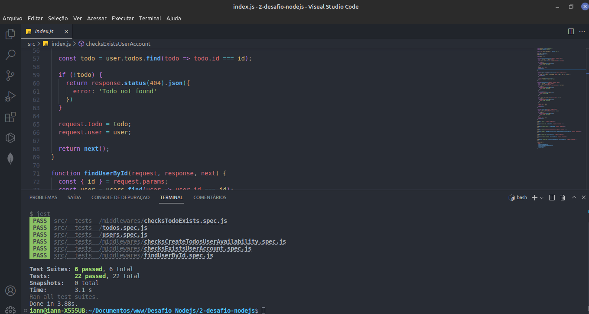

# Desafio 01 - Trabalhando com middlewares

## :computer: Sobre o desafio

Nesse desafio não será necessário alterar o código de nenhuma rota, apenas dos middlewares. Os testes irão também testar o funcionamento das rotas mas o resultado depende apenas da dos middlewares.

**Middlewares da aplicação**

  - **checksExistsUserAccount**: Esse middleware é responsável por receber o username do usuário pelo header e validar se existe ou não um usuário com o username passado. Caso exista, o usuário deve ser repassado para o request e a função next deve ser chamada.

  - **checksCreateTodosUserAvailability**: Esse middleware deve receber o **usuário** já dentro do request e chamar a função next apenas se esse usuário ainda estiver no **plano grátis e ainda não possuir 10 todos cadastrados** ou se ele **já estiver com o plano Pro ativado**. 

  - **checksTodoExists**: Esse middleware deve receber o **username** de dentro do header e o **id** de um *todo* de dentro de `request.params`. Você deve validar o usuário, validar que o `id` seja um uuid e também validar que esse `id` pertence a um *todo* do usuário informado.
   Com todas as validações passando, o *todo* encontrado deve ser passado para o `request` assim como o usuário encontrado também e a função next deve ser chamada.

  - **findUserById**: Esse middleware possui um funcionamento semelhante ao middleware `checksExistsUserAccount` mas a busca pelo usuário deve ser feita através do **id** de um usuário passado por parâmetro na rota. Caso o usuário tenha sido encontrado, o mesmo deve ser repassado para dentro do request.user e a função next deve ser chamada.

## :camera: Screenshot

  <h3 align="center">Testes dos middlewares</h3>
  

